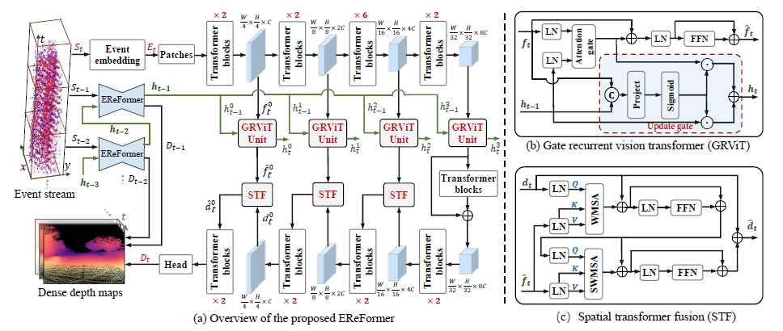

## Event-based Monocular Dense Depth Estimation with Recurrent Transformers

#### Dependencies

PyTorch >= 1.0
NumPy
OpenCV
Matplotlib

### (1) Setup
This code has been tested with Python 3.7.10, Torch 1.9.0, CUDA 10.2 on Ubuntu 16.04.

- Setup python environment
```
conda create -n EReFormer python=3.7.10
source activate EReFormer 
pip install -r requirements.txt
conda install -c pytorch pytorch=1.9.0 torchvision cudatoolkit=10.2
conda install -c conda-forge opencv
conda install -c conda-forge matplotlib
```
### (2) Public Datasets

The Multi Vehicle Stereo Event Camera Dataset - MVSEC Dataset:
https://daniilidis-group.github.io/mvsec/

Depth Estimation oN Synthetic Events - DENSE Dataset: 
https://rpg.ifi.uzh.ch/E2DEPTH.html
  
### (3) Start training

The model only supports fp32 and does not support low precision (e.g., fp16) acceleration.

```bash
cd EReFormer-main
python train.py --config configs/EReFormer_dense_epoch200_000032.json
```
